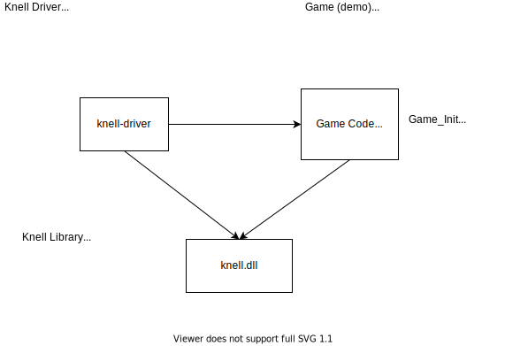

# Calendon

A 2D single-threaded main loop C99 game engine for prototyping and learning.

**Under active development, not suitable for production use**.

## Goal

- Speed the iteration time when creating 2D game demos and visual simulations.

### Method

- Dynamically load games/demos/prototypes with minimal interfaces and
  boilerplate, so programmers can focus on the ideas they want to experiment
  with and iterate quickly before adding to production systems.

### Guiding Design Principle (ASAP/ASAP)

- "As simple as possible": Doing things with the engine should be
  straightforward and explicit, but it might be more verbose than languages with
  more features than C.  That's ok.
- "As soon as possible": Use the ability to create prototypes to streamline
  the development process by trying ideas in fast-to-compile sandboxes.

### Limitations of Scope

- No true 3D support.  Many issues get much more complicated and harder to
  visualize and reason about in three dimensions.
- Core functionality shall only be written in C.  C provides mostly predictable
  symbol generation and more centralized control flow making it simpler to
  reason about program behavior while learning.  It also simplifies interfacing
  with other languages.

## Overview

The only code you write for Calendon is a game module which gets loaded by a
driver program at runtime.  Your game accesses Calendon functionality using the
same Calendon library that the driver does.



## How to Build

### Required Tools

Everywhere:
- **`cmake v3.10`** -- https://cmake.org/download/
    - Generates build configurations 
- **`git`** -- https://git-scm.com/downloads
    - For source control
- **`python 3.7`** -- https://www.python.org/downloads/
    - For the project's build/test front-end, `crank`.

Linux:
- **`SDL 2.0 libraries`**
- **`ccache`** (optional, improves build speeds)

Mac:
- I don't have a Mac to test on so I don't know if Calendon will even build on
  this platform.  If you're willing to help with Mac support, let me know!

### Building and running the demos

`crank` is a python wrapper for `cmake` and other tools, so people on different
platforms or with different IDEs, can do builds and run tests in the same way.
It also requires programs to register themselves so you know what tools your
build is using.  The only registered tool required to do a normal build is
`cmake`.

Your installation paths might be slightly different than those given here.

Windows, using powershell:
```powershell
py/crank.py register cmake "C:/CnProgram Files/CMake/bin/cmake.exe" 
```

Linux:
```bash
py/crank.py register cmake /usr/bin/cmake
```

Now you can generate your build files and build
```powershell
py/crank.py gen
py/crank.py build
```

and run demos:
```powershell
py/crank.py run planets
py/crank.py run koch-curve
py/crank.py run graphics-sample
```

### Testing

```bash
py/crank.py check
```

### Help

```bash
 py/crank.py --help
```
