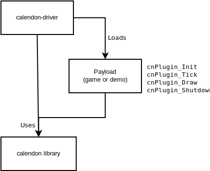
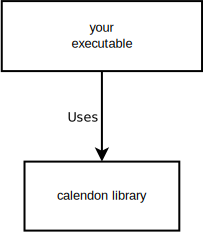

Using Calendon in a Project
===========================

Calendon can be used in two ways:

Driver
------

For quick setups and rapid iteration.

Write a shared library (or dll) payload which can be loaded and run by the Calendon driver
using command line arguments.

**Pros**

- Minimum effort required to start working.
- Can use Calendon's command-line tool, ``crank``, for building and running
  your application.
- Allows quick swapping between multiple demos.
- Easier to integrated updates to Calendon source code.
- Payloads on similar platforms and architecture can be shared.
- Leverage existing build configuration of Calendon.

**Cons**

- Works best inside the Calendon source tree.
- Requires configuration for targeting your payload to use
  the IDE for running and debugging.

Library
-------

Integrate Calendon into your executable and directly control initialization.

**Pros**

- Easier to share setups, since command line arguments aren't needed to run your executable.
- Simplified setup for debugging.
- Can use Calendon as either a static or dynamic library.

**Cons**

- More setup required to get started.
- More effort required to make and integrate Calendon changes.
- You must maintain your own build config.